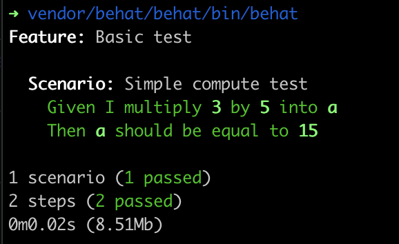

# Requirements
To run this project you will need a computer with PHP and composer installed.

# Install
To install the project, you just have to run `composer install` to get all the dependencies

# Adding useful aliases
To add useful aliases, just use this command `source bash_aliases.sh`

# Run docker
To run the docker containers, just use the `docker-compose up -d` command.
The containers are an instance of mariaDB and an adminer instance to check the database structure and data.
The database runs a previously made mysql dump to initiate the database, so no worries there.

# Running the tests
After installing the dependencies you can run the tests with this command `vfpm-test`.
The result should look like this :

# (Optionnal) You can add some dummy test data into the database
I have included some test data in a command `fleet init`.

# Running the commands
To run the commands, (supposing your sourced the bash_aliases.sh file), you need to run `fleet <name-of-the-command> [...params]`.
